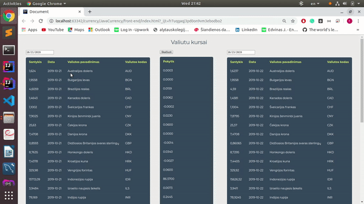

# Project Title

Valiutu kursai 

## Getting Started

first you need:\
1.JDK 11\
2.Some IDE to support maven\
3.Internet connection to download all needed dependencies
3 EC 6 or higher 

### Prerequisites

To run back-end you need to run HelloWorld.java in your IDE\
Then just put index.html file to your browser 
And you good to go!

### And coding style tests

Simple project for fun using API

## Built With

* [SparkJava](http://sparkjava.com/documentation#getting-started) - The web mini-framework used
* [Maven](https://maven.apache.org/) - Dependency Management
* [underscore.js](https://underscorejs.org/) - JS libary

## Version
test version 2019-10-23
## Authors

* **Edvinas Juckevicius** - *Initial work*

## GIF of project

## License

This project is licensed under the MIT License 

